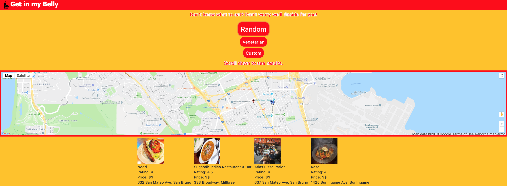

# Get In My Belly

## Screen Shot


(Had to zoom out on page to capture entire site)

## Technologies Used
- HTML - used to create elements on the DOM

- CSS - styles html elements on page

- Bootstrap - library of css style frameworks that allow us to create fast and easy responsive sites

- Javascript - allows dynamic interaction between user and computer data entry

- JQuery - a javascript library that allows for simple yet more diverse and less verbos language

- Google Maps API - Allowed our app to pin locations of user generated results from our Yelp API while displaying users current location

- Yelp API - Allowed our app to utilize results which were generated by user choices of random, vegetarian, or custom search results

- Git - version control system to track changes to source code

- GitHub - hosts repository that can be deployed to GitHub Pages

## Summary

This application allows the user to explore new food choices through our random or vegetarian search results that pick the top rated restaurants in the area. Our application also has the option to customize the search through the type of food, price range, and the amount of restaurants displayed below on our Google API powered map and Yelp API for restaurants.

## Code Snippet

```Javascript

var foodArray = ["chinese", "mexican", "burger", "sandwich", "pizza", "thai", "sushi", "korean", "chicken wings", "ramen", "hawaiian", "mediterranean", "arabic", "indian", "soul food"];

$(document).on("click", "#random", yelpInfo);

function yelpInfo() {

    jQuery.ajaxPrefilter(function (options) {
        if (options.crossDomain && jQuery.support.cors) {
            options.url = 'https://cors-anywhere.herokuapp.com/' + options.url;
        }
    });

    var randomFood = foodArray[Math.floor(Math.random() * foodArray.length)];
    console.log(randomFood);

    var yelpAPIkey = "szilVGiGWvqemg5iRsO467vT0806iGe5kazKMT1iONvN4XqA4fzTGbKMtpuIudFVSiRB7ikZ_ZWvI0Xr0ImMpuCdS_sMsejPHdti0ml3Wj_4TiirKzYxKZ7rWeB7XXYx"

    $("#yelp-info").empty();

    var queryURL = "https://api.yelp.com/v3/businesses/search?term=" + randomFood + "&limit=4&latitude=" + currentLocation.lat + "&longitude=" + currentLocation.lng

    $.ajax({
        url: queryURL,
        method: "GET",
        headers: {
            authorization: "Bearer " + yelpAPIkey
        }
    }).then(function (response) {

        console.log(response);

        var results = response.businesses;

        console.log(results);
        for (var i = 0; i < results.length; i++) {
            var restPos = {
                lat: results[i].coordinates.latitude,
                lng: results[i].coordinates.longitude
            };
            var marker = new google.maps.Marker({
                position: restPos,
                map: map,
                title: results[i].name,
                animation: google.maps.Animation.DROP,
                icon: "http://maps.google.com/mapfiles/ms/icons/blue-dot.png"
            });
            marker.setMap(map);
        }

        for (var i = 0; i < results.length; i++) {

            var newRest = $("<div id='restaurant'>");
            
            var restImage = $("");
            restImage.attr("src", results[i].image_url);

            var restName = $("<tr>").text(results[i].name);
            var restRating = $("<tr>").text("Rating: " + results[i].rating);
            var restPrice = $("<tr>").text("Price: " + results[i].price);
            var restAddress = $("<tr>").text(results[i].location.address1 + ", " + results[i].location.city);

            newRest.append(restImage);
            newRest.append(restName, restRating, restPrice, restAddress);

            $("#yelp-info").append(newRest);
            
        }
    });
};
```

The code above is what allows our first button "Random" to work. It generates a random food from our food array and uses that as a parameter within our queryURL utilizing the Yelp API. Within the function we then grab the latitude and longitude given from Yelp to create a marker on our Google Map on the page. Finally we append restaurants below our map which are the results given from the "Random" search.

```Javascript
var map;
var currentLocation = {};

function initMap() {
    if (navigator.geolocation) {
        navigator.geolocation.getCurrentPosition(function (position) {
            currentLocation = {
                lat: position.coords.latitude,
                lng: position.coords.longitude
            }

            map = new google.maps.Map(document.getElementById("map"), {
                center: {
                    lat: currentLocation.lat,
                    lng: currentLocation.lng
                },
                zoom: 15
            });

            var marker = new google.maps.Marker({
                position: currentLocation,
                map: map,
                title: "YOU ARE HERE!!!",
                animation: google.maps.Animation.DROP,
                icon: "http://maps.google.com/mapfiles/ms/icons/red-dot.png"
            })
            marker.setMap(map);
            console.log(currentLocation);
            console.log(map);
        })
    }
}
``

The code above is our usage of the Google Map API using navigator.geolocation to obtain the users current location in latitude and longitude then create a marker on our map. We use the same methodology within each of our "Random", "Vegetarian", and "Custom" buttons to plot the restaurant markers on our map as well.

``Javascript
var foodName;
var foodPrice;
var foodLimit;

$("#submit-button").on("click", function (event) {
    
    event.preventDefault();

    foodName = $("#food-input").val().trim();
    foodPrice = $("#price-input").val();
    foodLimit = $("#limit-input").val();

    if(foodName == "" || foodName == null){
        $("#blank").text(" Please type in a food");
    }
    if(foodPrice == "" || foodPrice == null){
        $("#blank2").text(" Please select a number");
    }
    if(foodLimit == "" || foodLimit == null){
        $("#blank3").text(" Please select a number");
    }
    else {
    yelpInfo3();
    
    $("#food-input").val("");
    $("#price-input").val("");
    $("#limit-input").val("");
    $("#blank").text("");
    $("#blank2").text("");
    $("#blank3").text("");

    }
});
```

The code above is what makes our users validate their inputs. We require our users to complete all the fields in our modal form to actually properly use the custom search button or else it will ask them to input data within the missing fields.

```Javascript
$(".main-btn").hover(function(){
    $(this).addClass("animated tada");
});

$(".main-btn").bind("animationend webkitAnimationEnd oAnimationEnd MSAnimationEnd", function () {
    $(this).removeClass("animated tada");
});
```
The code above demonstrates some of the new library we incorporated, Animate.css. This makes our buttons shake when you hover over them.

### Authors & Deployed Site

[Get In My Belly](https://jerry-dudum.github.io/project-1/)

Jerry Dudum
- [Github](https://github.com/Jerry-Dudum) 

Felico Lex Santos
- [Github](https://github.com/flexsant)

Andrew Duong
- [Github](https://github.com/duongsters)

Alexei Dias
- [Github](https://github.com/AlexeiDias)

