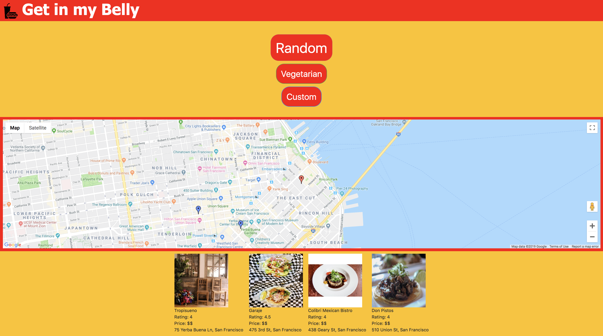

# project-1

## Screen Shot


## Technologies Used
- HTML - used to create elements on the DOM
- CSS - styles html elements on page
- Bootstrap - library of css style frameworks that allow us to create fast and easy responsive sites
- Javascript - allows dynamic interaction between user and computer data entry
- JQuery - a javascript library that allows for simple yet more diverse and less verbos language.
- Google Maps API - Allowed our app to pin locations of user generated results from our Yelp API while displaying users current location
- Yelp API - Allowed our app to utilize results which were generated by user choices of random, vegetarian, or custom search results. 
- Git - version control system to track changes to source code
- GitHub - hosts repository that can be deployed to GitHub Pages

## Summary
This application allows the user to explore new food choices through our random or vegetarian search results that pick the top rated restaurants in the area. Our application also has the option to customize the search through the type of food, price range, and the amount of restaurants displayed below on our Google API powered map.

## Code Snippet
`````Javascript

  var foodArray = ["chinese", "mexican", "burger", "sandwich", "pizza", "thai", "sushi", "korean", "chicken wings", "ramen", "hawaiian", "mediterranean", "arabic", "indian", "soul food"];

$(document).on("click", "#random", yelpInfo);

function yelpInfo() {

    jQuery.ajaxPrefilter(function (options) {
        if (options.crossDomain && jQuery.support.cors) {
            options.url = 'https://cors-anywhere.herokuapp.com/' + options.url;
        }
    });

    var randomFood = foodArray[Math.floor(Math.random() * foodArray.length)];
    console.log(randomFood);

    var yelpAPIkey = "szilVGiGWvqemg5iRsO467vT0806iGe5kazKMT1iONvN4XqA4fzTGbKMtpuIudFVSiRB7ikZ_ZWvI0Xr0ImMpuCdS_sMsejPHdti0ml3Wj_4TiirKzYxKZ7rWeB7XXYx"

    $("#yelp-info").empty();

    var queryURL = "https://api.yelp.com/v3/businesses/search?term=" + randomFood + "&limit=4&latitude=" + currentLocation.lat + "&longitude=" + currentLocation.lng

    $.ajax({
        url: queryURL,
        method: "GET",
        headers: {
            authorization: "Bearer " + yelpAPIkey
        }
`````

## Author Links

https://jerry-dudum.github.io/project-1/